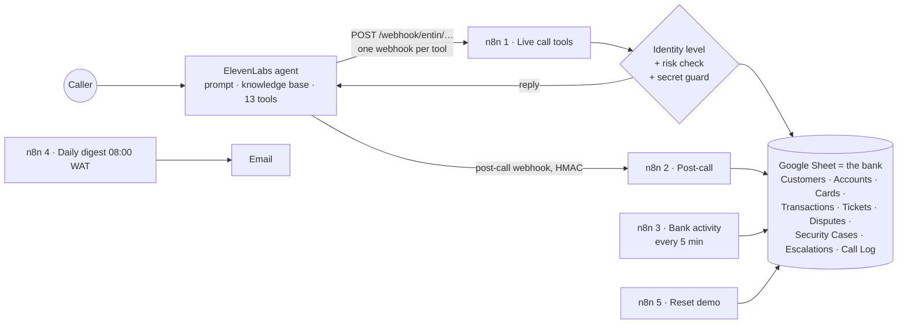

# ENTIN Bank: AI voice support where the workflow, not the prompt, enforces the rules

A voice agent for **ENTIN Bank**, a fictional Nigerian bank with 500 synthetic customers. It handles failed transfers, card disputes, lost cards, fraud and login problems. **Identity checks and risk rules are enforced inside the n8n workflows**, so no caller, and no prompt injection, can talk the agent past them.

Built with **ElevenLabs Agents** (voice, 13 tools), **n8n** (5 workflows) and **Google Sheets** as the bank's records.

> **Status:** complete as a synthetic demo. 33 end-to-end scenarios pass against the exported workflows, and all 5 workflows pass n8n-mcp validation. Live calls against a real Google Sheet haven't been verified yet (see below).
>
> **Fully synthetic.** There is no real bank, API, account, payment or customer data. Account numbers use a fake `99…` range, phones a fake `+234 700 001…` range, and banks and merchants are invented. No customer SMS is ever sent.

## Why

- **Bank support is the hardest case for a voice agent.** The caller is often distressed, and the request is usually consequential. The agent is one confident sentence away from revealing an account to someone who hasn't proven they own it.
- **Prompt instructions alone cannot be the security control.** A prompt can be argued with; a workflow node can't.
- **Callers expect real answers** ("when will my money come back?"), so timelines are quoted from the regulator (CBN), with their source, rather than invented.

## How it works



1. **The caller explains the problem.** The agent picks one of its 13 tools, and every tool is a webhook into the "Live call tools" workflow.
2. **The workflow decides what the caller may see,** based on how far they've verified their identity (below). The agent only speaks the reply it gets back.
3. **Risk is scored** LOW, MEDIUM or HIGH on every request. HIGH always ends with a human.
4. **Every step is written to the Call Log**, so the behaviour can be checked rather than trusted.
5. **After the call,** a signed (HMAC) post-call webhook stores a redacted summary and emails a QA note. A background workflow keeps the bank "alive" with salaries, POS payments, transfers and the occasional failure, and a daily digest emails at 08:00 WAT.

## Safety rules (enforced in n8n, not just the prompt)

- **Graded identity:**
  - **Anonymous callers** get knowledge-base answers only.
  - **Name + card last-4** can block a card or check a ticket.
  - **Name + date of birth + account last-4 + phone last-4** unlocks transaction details.
  - Two failed attempts **lock the call**.
  - Verification lasts 15 minutes and belongs to one conversation.
- **Secret guard.** The **Which Step?** node rejects any request containing a PIN, OTP, CVV, password or card number. It opens a Security Case, and **the secret is never written down.** The agent never asks for one.
- **Risk only goes up.** It rises for a denied payment, ₦1m or more, a repeat complaint, a restricted account or a failed verification, and it never falls during a call. HIGH always ends with a human.
- **CBN timelines, with sources:**

  | Case | Timeline |
  |---|---|
  | ENTIN's own ATMs | instant |
  | Another bank's ATM | 48 hours |
  | POS | 72 hours |
  | Failed transfers | 72 hours |
  | Complaints | 14 days |

## Tools (13)

`verify_caller` · `assess_request` · `find_transactions` · `get_transaction_status` · `create_dispute` · `create_ticket` · `get_ticket_status` · `get_card_status` · `block_card` · `get_digital_access_status` · `report_security_event` · `find_branch_or_atm` · `request_human_handoff`

Each is defined in `agent/tools/*.json`. The logic behind each lives in `n8n/src/live/`.

## Repo layout

| Path | What it is |
|---|---|
| `agent/` | ElevenLabs prompt, first message, 13 tool definitions, knowledge base (4 documents), evaluation criteria, test calls, and **`SETUP.md`** |
| `n8n/` | The 5 importable workflows, `build_workflows.py`, Code-node logic in `src/`, and the test runner in `test/` |
| `data/` | `generate_bank.py`, which produces `entin-bank.xlsx` with 500 synthetic customers (import it into Google Sheets) |
| `docs/` | Kickoff brief, design specs (data model, API contracts, intents and risk), and the setup and tools guides |
| `ENTIN-Setup-Guide.pdf`, `ElevenLabs-Tools-Sheet.pdf` | Printable setup and tools references |
| `legacy/` | The first version (a Python API with 29 tests), kept for reference |

## Setup

Start with **[agent/SETUP.md](agent/SETUP.md)**. In short:
1. Import `data/entin-bank.xlsx` into Google Sheets. `data/generate_bank.py` rebuilds it.
2. Import the 5 workflows from `n8n/` and connect Google Sheets and email.
3. Create the ElevenLabs agent with the prompt, knowledge base and the 13 tools in `agent/tools/`, pointing at your n8n webhooks.
4. Set the post-call webhook's HMAC secret in workflow 2.
5. Run workflow 5, "Reset demo", before each demo.

Run the scenario tests (Node, no network):
```bash
node n8n/test/run_tests.mjs
```

## Verified

- ✅ **33 end-to-end scenarios pass** against the exported workflow JSON and the 500-customer data, including:
  - a full caller conversation
  - rejecting secrets
  - the lock after two failed verifications
  - blocking every card
  - the three background workflows
  - the demo reset
- ✅ **Deliberately breaking a rule makes the tests fail.** Letting unverified callers see transactions, or switching off OTP detection, were both caught.
- ✅ **All 5 workflows pass n8n-mcp validation with 0 errors.** The Code-node contents were replaced with stubs for that check; the tests above run the real code.
- ✅ **Checked by [Agent Preflight](https://github.com/nwanduben/agent-preflight),** the pre-release checker built alongside this project. It flagged the placeholder webhook secret and a tool field no workflow reads, which are exactly the things to fix before going live.

## Not yet verified

- Running live in n8n against a real Google Sheet, including Google Sheets API speed during a call.
- Live ElevenLabs calls, and voice quality in Yoruba, Hausa, Igbo and Pidgin.

## Notes

ENTIN Bank is **fictional**, and every customer, account, card and transaction is synthetic. This is a portfolio demonstration, not a banking system.
